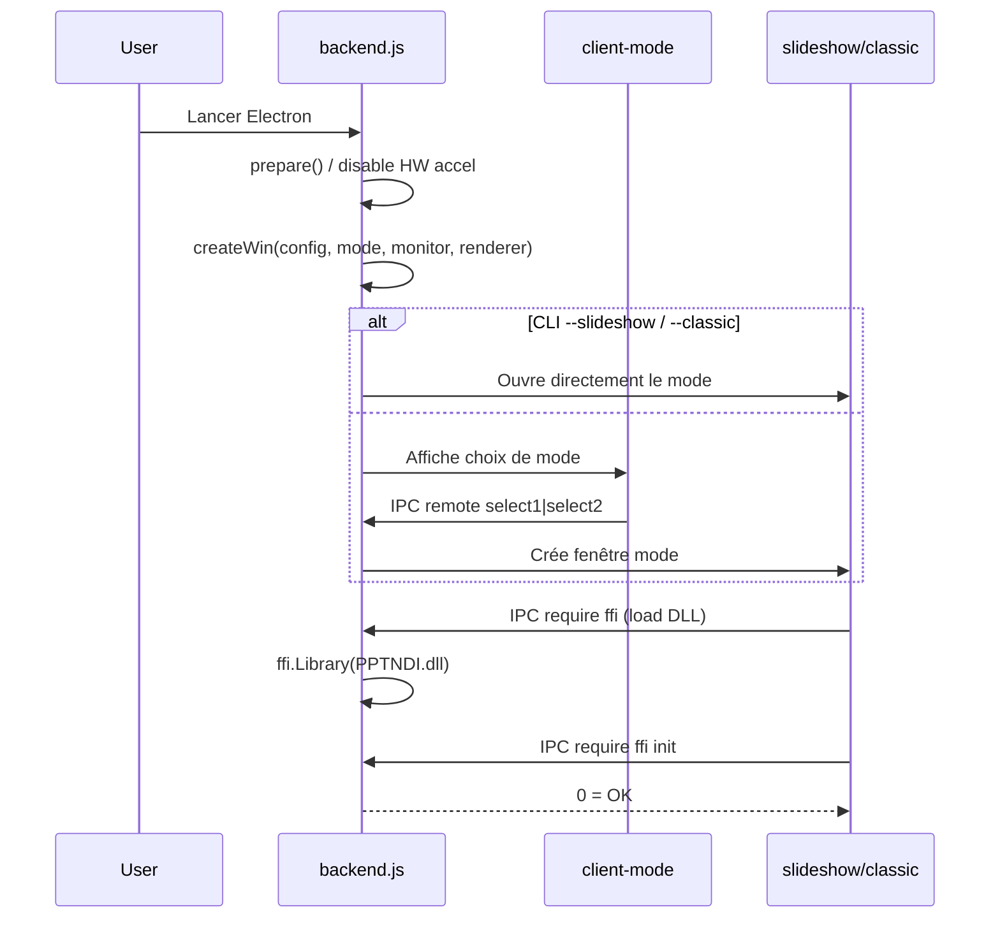
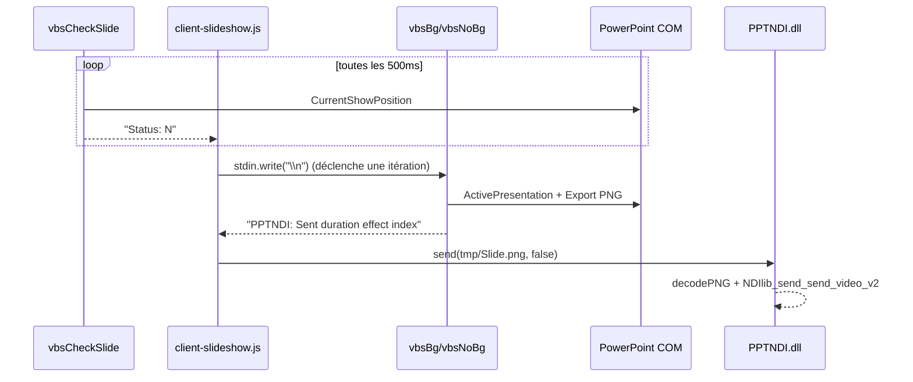
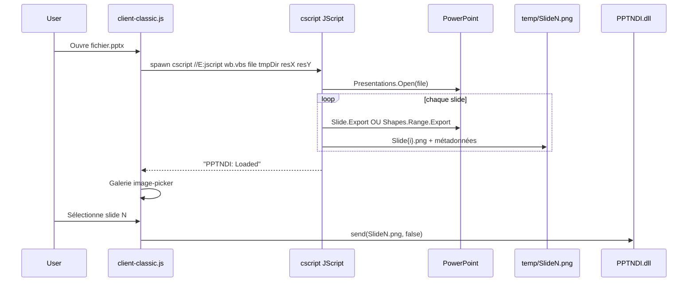

# 02 — Flux de données

## 1. Démarrage application



## 2. Mode SlideShow (live)

### Processus parallèles

À l’init (`client-slideshow.js` → `init()`), 3 scripts sont spawnés :

| Process | Script | Rôle |
|---------|--------|------|
| `res` | `vbsBg` ou `vbsNoBg` | Export PNG de la slide courante (bloqué sur stdin) |
| `res2` | `vbsDirectCmd` | Commandes prev/next/black/white/pause |
| `res3` | `vbsCheckSlide` | Poll toutes les 500 ms de l’index de slide |

### Boucle de capture



### Messages stdout importants

| Message | Signification |
|---------|---------------|
| `PPTNDI: Sent {dur} {effect} {idx}` | PNG écrit, prêt à envoyer |
| `PPTNDI: Black` / `White` | Écran noir / blanc diaporama |
| `PPTNDI: Done` | Fin du slideshow |
| `PPTNDI: Ready` | Présentation ouverte, pas encore en show |
| `PPTNDI: NoPPT` | PowerPoint introuvable |
| `Status: N` | Index slide (poller) |
| `Status: OFF` | Pas de SlideShowWindow |

### Transitions soft (optionnelles)

Si l’effet / durée le justifie, `procTransition()` :

1. Garde `SlidePre.png` (frame précédente).
2. Utilise `merge-images` pour générer `t2.png`…`t9.png` (crossfade).
3. Envoie chaque frame via FFI avec des timers proportionnels à `duration`.

## 3. Mode Classic (batch)



### Fichiers annexes générés

| Fichier | Contenu |
|---------|---------|
| `Slide{n}.png` | Image de la diapo |
| `hidden.dat` | Index des slides masquées |
| `advance.dat` | Avance automatique (temps) |
| `slideEffect.dat` | `index,entryEffect,duration` |

## 4. Pipeline NDI

```
Slide.png (disque)
    → ffi send(path, bool)
        → PPTNDI.cpp::send()
            → loadFile (PNG bytes)
            → decodePNG (picopng) → RGBA
            → NDIlib_video_frame_v2_t
            → NDIlib_send_send_video_v2 (x1 ou x2)
```

Le 2ᵉ paramètre `trans` (bool) : si `true`, n’envoie qu’**une** fois la frame ; sinon **deux** (astuce pour forcer le refresh côté receivers).

En mode “high performance”, `backend.js` relance périodiquement `send(...lastImageArgs)` pour maintenir le flux.

## 5. Renderer interne (fallback)

Quand PowerPoint n’est pas utilisé (`renderMode === "Internal"`) :

1. `pptx-compose` dézippe / parse le PPTX en JSON XML.
2. `renderer.js` reconstruit un DOM HTML approximatif.
3. `html-to-image` capture `#renderer` en PNG.
4. Moins fidèle (polices, effets, SmartArt, etc.) — **expérimental**.

## 6. Chemins temporaires

| OS | Base |
|----|------|
| Windows | `%PROGRAMDATA%/PPT-NDI/temp/{timestamp}/` |
| macOS | `$TMPDIR/ppt_ndi/{timestamp}/` |

Toujours nettoyer ces dossiers à la fermeture / rechargement.
